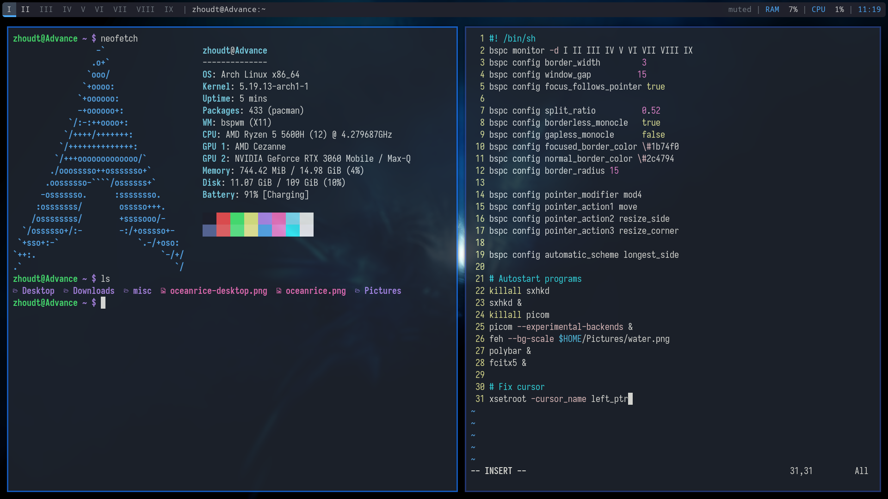

# dotfiles-ocean
The dotfiles for a BSPWM setup with a dark ocean color scheme

Contains install script for Arch Linux.

Required packages for Arch: (installed by script):

	[AUR] paru-bin (To install betterlockscreen)
	
	[AUR] betterlockscreen (Lock screen client)
	
	OPTIONAL: zsh (Shell)
	
	exa (`ls` replacement, `ls` is aliased to `exa`)
	
	alacritty (Terminal emulator)

	bspwm (Tiling window manager)
	
	sxhkd (Keybind manager for BSPWM)

	polybar (Bar for BSPWM)

	rofi (dmenu alternative)

	firefox (browser)

	vim (text editor)

	ttf-iosevka-nerd (Terminal font)

	feh (To set wallpaper)

	picom (Compositor)

	pulsemixer (For audio control)

	brightnessctl (For controlling screen brightness)

INSTRUCTIONS:

To install for Arch Linux, run the installation script (`./install-arch.sh`). For other distributions, install required packages and manually move things to their respective directories.
